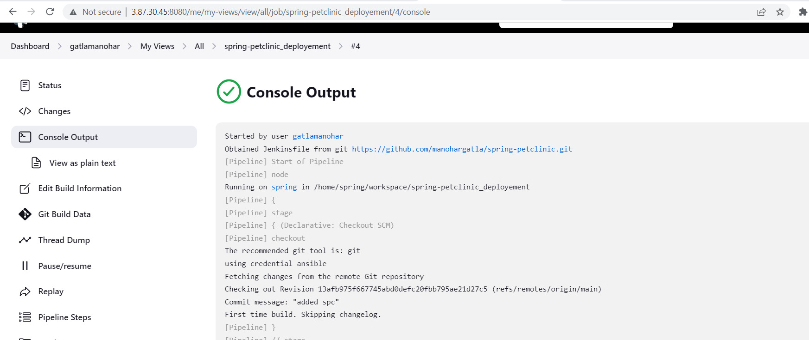
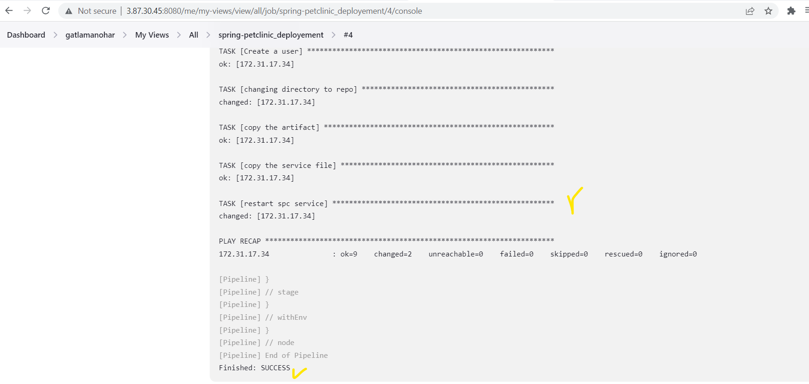
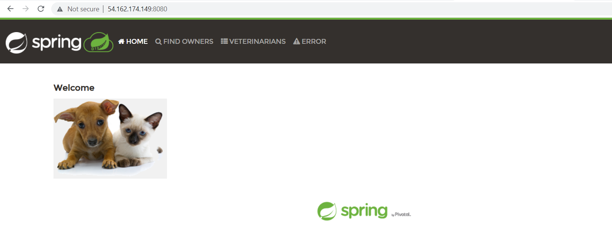

# Deploy Spring-petclinic application playbook from ansible through jenkins pipeline
# Setup
* Create 3 virtual machines set Jenkins server with 1 node and install ansible in node with one inventory
* Write a jenkins pipeline to build maven package in node
* Call the playbook in ansible inventory node from pipeline
```Json
pipeline {
    agent { label 'ansible_jenkins' }
    stages {
        stage('clone sources') {
            steps {
                git branch: 'main',
                url: 'https://github.com/manohargatla/spring-petclinic.git' 
            }
        }
        stage('build package') {
            steps {
                sh 'cd ${WORKSPACE} && ./mvnw package'
            }
        }
        stage('apply playbook') {
            steps {
                sh 'ansible -i hosts -m ping all'
                sh 'ansible-playbook -i hosts spring-petclinic.yaml'
            }
        }
        
    }
}
``` 
* Setup the jenkins server with node configuration
* create a declarative pipline project and build



